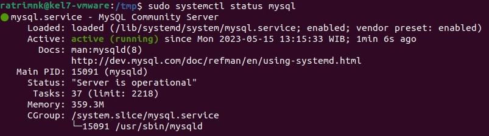
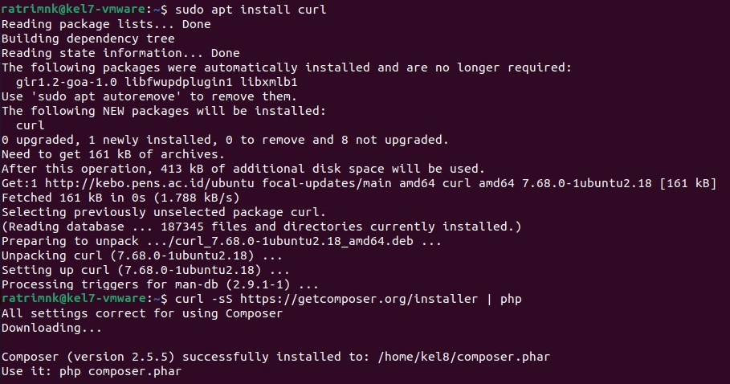

LAPORAN RESMI  
WORKSHOP ADMINISTRASI JARINGAN  
Web Server  

  

Dosen Pengampu: 
Dr. Ferry Astika Saputra ST, M.Sc	

Disusun Oleh: 
Latifian Iman (3121600033)  
Ratri Maria Manik (3121600039)  
Dzikri Mutawakkil (3121600041)  

PROGRAM STUDI TEKNIK INFORMATIKA 
POLITEKNIK ELEKTRONIKA NEGERI SURABAYA 
TAHUN 2023

  

## Installasi Apache2
Web Server yang akan digunakan adalah apache. Sehingga untuk melakukan instalasi menjalankan perintah 
**sudo apt install apache2** 
  

Setelah Web Server berhasil diinstall, diperlukan perintah untuk memodifikasi pengaturan firewall untuk mengizinkan akses dari luar ke port web default. Ini dilakukan menggunakan UFW, apabila belum memiliki UFW kita bisa melakukan instalasi terlebih dahulu menggunakan perintah 
**sudo apt install ufw** 
  

Selanjutnya, kita melihat list dari ufw application menggunakan perintah 
**sudo ufw app list** 
  

Selanjutnya melakukan perintah untuk mengijinkan 'WWW' menggunakan perintah 
**sudo ufw allow 'WWW'** 
  

Untuk melihat hasilnya enable ufw tersebut dan lihat statusnya, gunakan perintah 
**sudo ufw enable** 
**sudo ufw status** 
  

Proses instalasi terakhir adalah melakukan pengecekan terhadap status apache / web server menggunakan perintah 
**sudo systemctl status apache2** 
  

Untuk memastikan berjalan, kita membuka server ip kita ke browser seperti chrome, mozilla atau edge. Berikut tampilan ketika web server sudah berjalan 
  

## Installasi PROFTPD
Melakukan instalasi PROFTPD menggunakan perintah 
**sudo apt install proftpd -y** 
  

Kemudian menjalankan PROFTPD menggunakan perintah start dan status untuk melihatnya 
**systemctl start proftpd** 
**systemctl status proftpd** 
  

## Installasi PHP
Menggunakan perintah 
**sudo apt install php** 
**php -v** 
  

## Installasi MySQL
Sebelum melakukan instalasi mysql, menambahkan repository mysql dengan cara 
**cd tmp** 
**wget https://dev.mysql.com/get/mysql-apt-config_0.8.22-1_all.deb** 
  

Setelah itu, mysql sudah siap untuk diinstal menggunakan dpkg yang berfungsi untuk install, remove dan inspect software packages. 
**sudo dpkg -i mysql-apt-config** 
  

Setelah itu, package siap diinstal menggunakan perintah 
**sudo apt install mysql-server** 
  

Dan melakukan pengecekan menggunakan perintah systemctl status 
**sudo systemctl status mysql** 
  

Terakhir, menjalankan perintah 
**mysqladmin -u root -p version** 
.png)  

## Installasi Laravel
Install curl untuk mengirim atau menerima data melalui protokol seperti HTTP, HTTPS, FTP 
**sudo apt install curl** 
Gunakan curl command berikut untuk mendownload file Composer 
**url -sS https://getcomposer.org/installer | php** 
Kemudian pindah composer.phar ke /usr/local/bin/composer 
**sudo mv composr.phar /usr/local/bin/composer** 
  