

LAPORAN RESMI  
WORKSHOP ADMINISTRASI JARINGAN  
Mail Server  

  

Dosen Pengampu: 
Dr. Ferry Astika Saputra ST, M.Sc	

Disusun Oleh: 
Latifian Iman (3121600033)  
Ratri Maria Manik (3121600039)  
Dzikri Mutawakkil (3121600041)  

PROGRAM STUDI TEKNIK INFORMATIKA 
POLITEKNIK ELEKTRONIKA NEGERI SURABAYA 
TAHUN 2023

  

## Requirement
1. Mail server adalah sebuah sistem yang membantu dalam pendistribusian email, baik dalam proses menerima atau mengirim. Secara sederhana, mail server adalah perantara dalam proses pengiriman dan penerimaan surat. Email yang dikirim akan disimpan pada mail server, kemudian selanjutnya diforward oleh mail server ke penerima. 

2. Postfix adalah mail transfer agent free dan open source. Postfix merupakan mail transfer agent default untuk sejumlah sistem operasi bertipe Unix. Postfix didistribusikan menggunakan Lisensi Umum IBM 1.0 yang merupakan lisensi perangkat lunak bebas tetapi tidak kompatibel dengan GPL. Salah satu ketangguhan Postfix adalah kemampuannya menahan “buffer overflow”. Ketangguhan lainnya adalah kesanggupan Postfix memproses surat elektronik dalam jumlah banyak. 

3. Dovecot adalah server email IMAP dan POP3 open source untuk sistem Linux / UNIX, yang ditulis dengan mengutamakan keamanan. Dovecot adalah pilihan yang sangat baik untuk instalasi kecil dan besar. Cepat, mudah diatur, tidak memerlukan administrasi khusus dan hanya menggunakan sedikit RAM/memori. 

4. Roundcube adalah email client IMAP berbasis web. Fitur Roundcube yang paling menonjol adalah penggunaan teknologi Ajax. Salah satu software open source yang berlisensi GNU General Public License (GPL). 

## Konfigurasi Postfix dan Dovecot
Sebelum memulai install mail server, ada baiknya siapkan domain khusus yang akan digunakan untuk konfigurasi mail server. Dalam contoh konfigurasi kali ini akan menggunakan nama domain mail.kampus-07.takehome.com yang dibuat menggunakan bind9 secara lokal. 
1. Update repository dan install package postfix, dengan menggunakan perintah 
**apt update** 
**apt install postfix dovecot-imapd dovecot-pop3d** 

2. Konfigurasi Postfix 
Setelah installasi selesai akan muncul message box, kemudian pilih internet site agar komunikasi email menggunakan protokol SMTP secara langsung. 
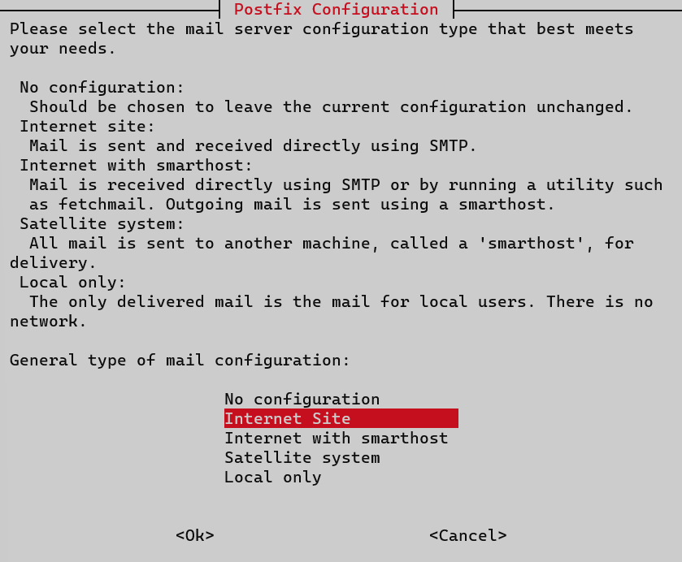  

Selanjutnya masukkan nama domain yang ingin digunakan 
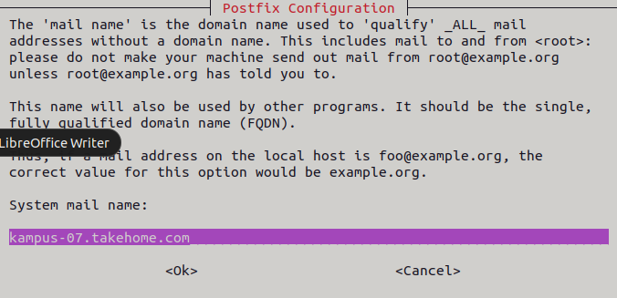  

Setelah itu, postfix akan menyelesaikan installasinya. Setelah Installasi selesai, edit file di /etc/postfix/main.cf dan tambahkan home_mailbox = Maildir/ pada baris paling bawah. 
**sudo nano /etc/postfix/main.cf** 

**inet_interfaces = all** 
**inet_protocols = all** 
#tambahkan baris berikut pada baris paling bawah home_mailbox = Maildir/ 

buat mail directory di directory /etc/skel 
**maildirmake.dovecot /etc/skel/Maildir** 

Setelah itu masukkan perintah berikut 
**dpkg-reconfigure postfix**
Pilih beberapa pilihan dan isikan beberapa input yang akan muncul, sesuaikan dengan topology/konfigurasi sistem dan kebutuhan. 
  
  
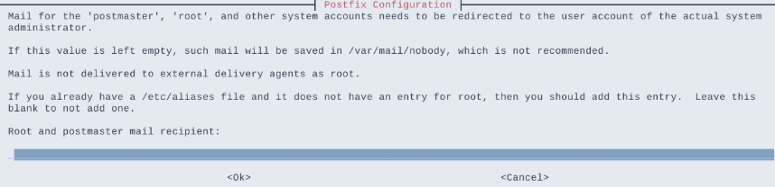  
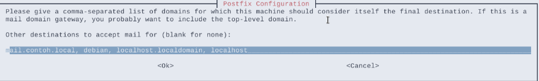  
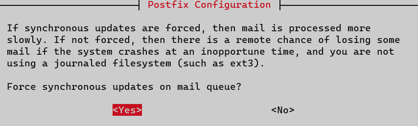  
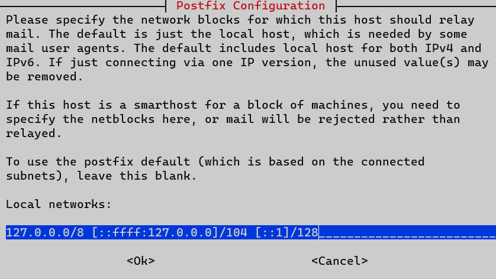  
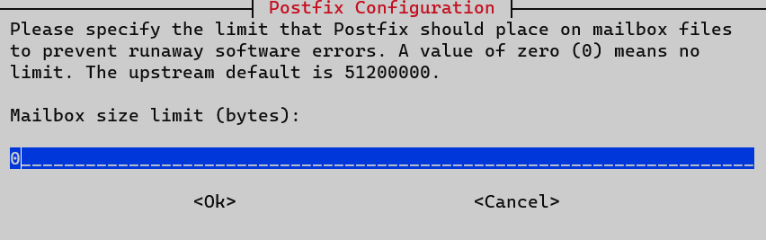  
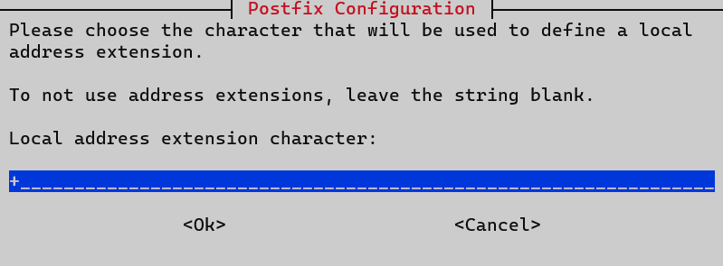  
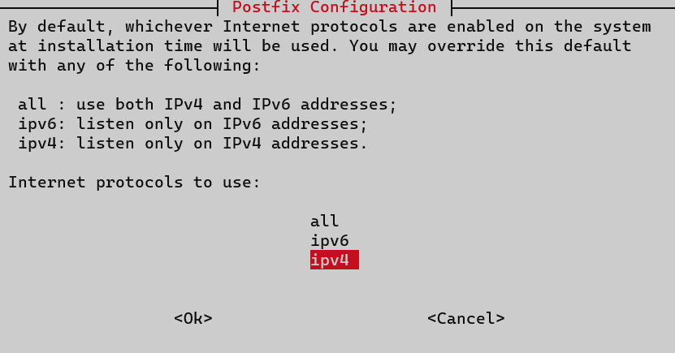  

Restart postfix service, dengan menggunakan perintah 
**systemctl restart postfix**

3. Konfigurasi Dovecot 
Edit file konfigurasi /etc/dovecot/dovecot.conf. 
**sudo nano /etc/dovecot/dovecot.conf** 

Uncomment dan edit baris berikut. 

**# If you want to specify non-default ports or anything more complex,**
**# edit conf.d/master.conf.**
**listen = *** 
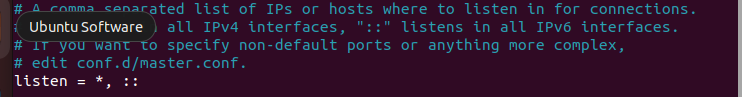  

Edit file konfigurasi /etc/dovecot/conf.d/10-auth.conf. 
**sudo nano /etc/dovecot/conf.d/10-auth.conf** 

Uncomment dan ganti dari yes ke no. 
**# connection is considered secure and plaintext authentication is allowed.** 
**# See also ssl=required setting.** 
**disable_plaintext_auth = no** 
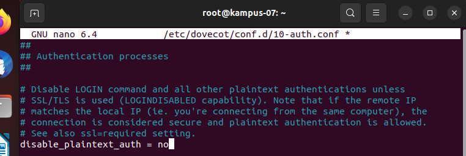  

Edit file konfigurasi /etc/dovecot/conf.d/10-mail.conf. 
**sudo nano /etc/dovecot/conf.d/10-mail.conf** 

Uncomment pada baris berikut. 
**mail_location = maildir:~/Maildir** 
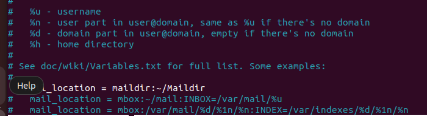  

Beri comment pada baris berikut. 
**# mail_location = mbox:~/mail:INBOX=/var/mail/%u** 

Restart dovesot service, dengan menggunakan perintah 
**systemctl restart dovecot**

## Konfigurasi RoundCube
1. Install Mariadb dan Roundcube
Install roundcube sebagai webmail yang akan digunakan oleh client, dan package mariadb yang nantinya akan digunakan sebagai database dari roundcube.
**apt install mariadb-server roundcube**
Pilih yes untuk membuat database secara otomatis oleh roundcube. 
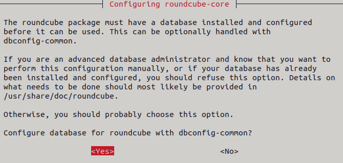  

Masukkan password database roundcube. 
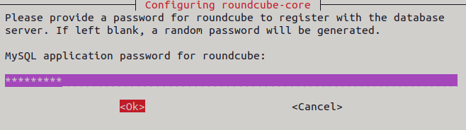  
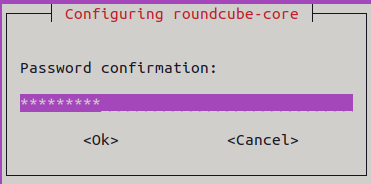  

Edit file /etc/roundcube/config.inc.php. 
**sudo nano /etc/roundcube/config.inc.php** 

Isikan default host dengan nama domain mail server. 
**// For example %n = mail.domain.tld, %t = domain.tld** 
**$config['default_host'] = 'mail.kampus-02.takehome.com';** 

Ganti smtp server dengan nama domain mail server. 
**// For example %n = mail.domain.tld, %t = domain.tld** 
**$config['smtp_server'] = 'mail.kampus-02.takehome.com';** 

Ganti smtp port dari 587 ke 25. 
**// SMTP port. Use 25 for cleartext, 465 for Implicit TLS, or 587 for STARTTLS (default)**
**$config['smtp_port'] = 25;**

Kosongkan value dari smtp user. 
**// will use the current username for login**
**$config['smtp_user'] = '';**

Kosongkan value dari smtp password 
**// will use the current user's password for login**
**$config['smtp_pass'] = '';**

Configure ulang roundcube (langkah ini bisa dilewati). 
**dpkg-reconfigure roundcube-core**

Kosongkan karena kita tidak menggunakan tls. 
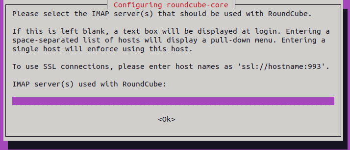  

Pilih bahasa untuk roundcube. 
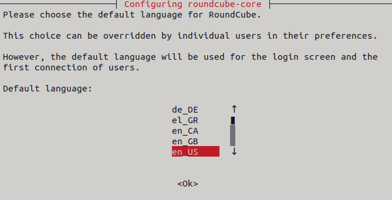  

Pilih no jika tidak ingin reinstall database yang telah dibuat. 
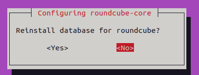  

Check pada pilihan apache dan uncheck lighttpd. 

Pilih yes untuk merestart web server. 
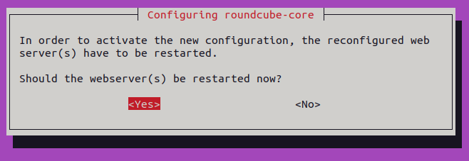  

Keep local version jika tidak ingin merubah versi roundcube ke yang lebih terbaru. 
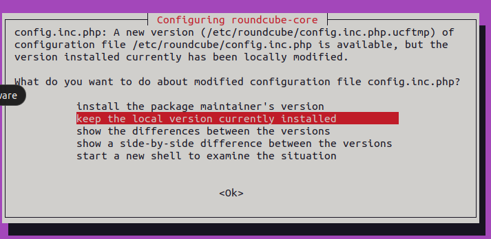  

Edit apache config untuk memasukkan konfigurasi tambahan dari roundcube ke apache config. 
**sudo nano /etc/apache2/apache2.conf** 
Tambahkan pada baris paling bawah. 
**Include /etc/roundcube/apache.conf** 
Selanjutnya, masuk ke directory website apache dan tambahkan file baru untuk mail server. 
**cd /etc/apache2/sites-available**
**touch mail.conf**
**vi mail.conf**
**<VirtualHost *:80>**
**ServerName mail.kampus-02.takehome.com**
**DocumentRoot /usr/share/roundcube**
</VirtualHost>

Disable apache default config dan enable kan mail config.
**a2dissite 000-default.conf**
**a2ensite mail.conf** 

Restart apache service. 
**sudo systemctl restart apache2**

## Testing
1. Buat user untuk mail terlebih dahulu
**adduser satu**
**adduser dua**

jangan lupa restart postfix dan dovecot 
**systemctl restart postfix dovecot**

2. Testing dengan telnet
**apt install telnet**

Test kirim file menggunakan perintah telnet dengan menggunakan port 25 (SMTP). Masukkan nama alamat pengirim menggunakan mail from:. Masukkan nama alamat penerima menggunakan rcpt to:. Ketikkan data lalu enter. Isikan subject dengan megetikkan Subject: . Lalu isikan pesan yang akan dikirim kemudian isikan titik (.) untuk mengakhiri pesan. 
**telnet mail.kampus-02.takehome.com 25** 

Melihat pesan menggunakan perintah telnet . Login user menggunakan user . Dan masukkan password menggunakan pass . Untuk melihat list pesan yang diterima menggunakan perintah list. Dan untuk membuka pesan yang diterima menggunakan perintah retr .
Perintah quit untuk keluar dari telnet. 
**telnet mail.kampus-02.takehome.com 110**

3. Selanjutnya buka web browser pada sisi client dan masukkan domain dari mail server (mail.kampus-02.takehome.com), maka akan muncul interface dari roundcube. Lalu login menggunakan salah satu user yang telah dibuat. 

Klik pada compose dan isikan pesan untuk user lainnya. Lalu klik send. 
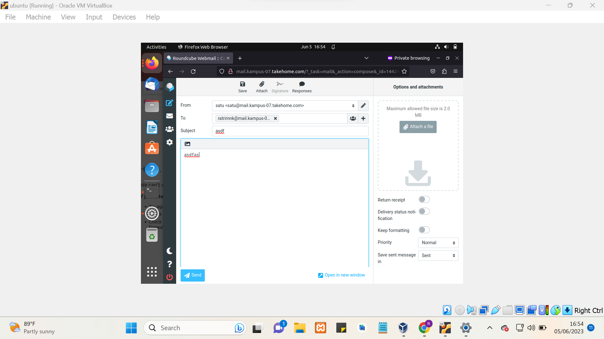  