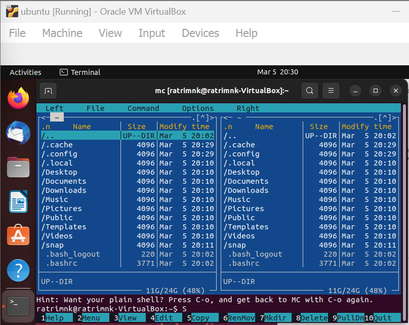
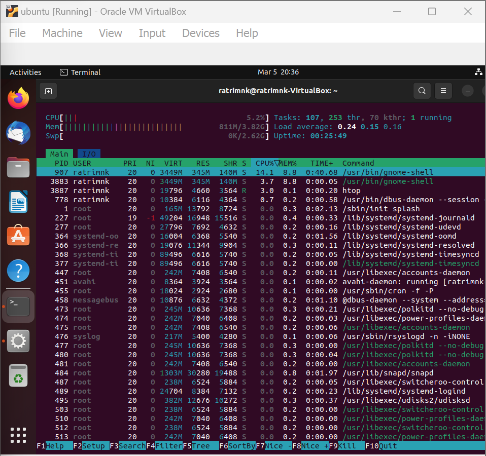

## Evolusi Sistem Operasi

Seperti halnya manusia, system operasi (OS) yang kita miliki dan kita gunakan saat ini tentunya tidak langsung muncul dalam bentuk yang sudah sebagus sekarang. Ya, system operasi (OS) juga pernah mengalami masa-masa sebuah evolusi ( tingkat pengembangannya).Mulai dari jaman tanpa OS, awal terciptanya OS, hingga evolusi-evolusi yang perlu dilakukan pengembangan dengan tujuan menambal kekurangan kekurangan yang ada dimiliki ole OS pendahuluannya. Akan ada 4 masa evolusi OS yang akan saya bahas Kali ini yaitu :

- Sistem Operasi Batch **(1950-an-1960-an)**: Sistem operasi pertama yang diciptakan adalah sistem operasi batch. Sistem ini memungkinkan pengguna untuk mengumpulkan pekerjaan mereka dalam satu file, dan sistem operasi akan memproses file tersebut secara otomatis. Namun, sistem ini tidak interaktif dan tidak memiliki antarmuka pengguna.

- Sistem Operasi Time-Sharing **(1960-an-1970-an)**: Sistem operasi Time-Sharing memungkinkan beberapa pengguna untuk menggunakan sistem secara bersamaan. Sistem ini juga memperkenalkan antarmuka pengguna interaktif dan beberapa perintah yang lebih mudah digunakan.

- Sistem Operasi Personal Computer **(1980-an)**: Dengan munculnya komputer pribadi, sistem operasi seperti DOS (Disk Operating System) dan MacOS mulai populer. Sistem operasi ini memungkinkan pengguna untuk mengakses komputer secara pribadi dan mudah digunakan.

- Sistem Operasi Jaringan **(1990-an-2000-an)**: Sistem operasi jaringan, seperti Windows NT dan Unix, memungkinkan pengguna untuk terhubung dengan jaringan komputer dan berbagi sumber daya seperti printer dan file.

- Sistem Operasi Mobile **(2000-an-2010-an)**: Dengan munculnya ponsel pintar dan tablet, sistem operasi mobile seperti iOS dan Android menjadi populer. Sistem operasi ini dirancang untuk mendukung perangkat yang lebih kecil dan mudah digunakan dalam perangkat mobile.

- Sistem Operasi Cloud **(2010-an dan seterusnya)**: Sistem operasi cloud seperti Amazon Web Services (AWS) dan Microsoft Azure memungkinkan pengguna untuk menggunakan komputasi awan untuk menyimpan dan memproses data. Sistem operasi ini dirancang untuk berjalan di pusat data dan menyediakan sumber daya komputasi yang fleksibel dan mudah diakses. Secara keseluruhan, evolusi sistem operasi mencerminkan kemajuan teknologi dan perubahan kebutuhan pengguna. Dari batch processing hingga cloud computing, sistem operasi terus berkembang untuk memenuhi kebutuhan pengguna yang semakin kompleks.

### Ubuntu

Ubuntu pertama kali dirilis pada tanggal 20 Oktober 2004 oleh Canonical Ltd., sebuah perusahaan yang didirikan oleh entrepreneur Mark Shuttleworth. Ubuntu awalnya didasarkan pada distribusi Debian Linux, tetapi seiring waktu telah mengembangkan identitasnya sendiri dan memperkenalkan fitur-fitur baru.
Nama 'Ubuntu' berasal dari filosofi Afrika Selatan yang mengajarkan tentang kesatuan dan persatuan antara manusia. Ubuntu didasarkan pada prinsip-prinsip ini, dan bertujuan untuk memberikan pengalaman pengguna yang lebih manusiawi dan terhubung dengan komunitas luas.
Ubuntu telah menjadi salah satu distribusi Linux yang paling populer di dunia, dan digunakan oleh jutaan pengguna di seluruh dunia. Canonical Ltd. terus mengembangkan Ubuntu dengan pembaruan berkala dan meningkatkan kinerja serta keamanannya.

### Versi Ubuntu

Versi terbaru dari Ubuntu saat ini adalah versi 20.04 LTS (Long-Term Support), yang dirilis pada bulan April 2020. Ubuntu 20.04 LTS menawarkan berbagai fitur baru, termasuk dukungan untuk teknologi terbaru dan pembaruan keamanan yang lebih baik.

### Debian

Debian adalah sistem operasi open-source yang populer berbasis pada kernel Linux. Pertama kali dirilis pada tahun 1993, Debian telah menjadi salah satu distribusi Linux yang paling stabil dan aman. Debian dirancang untuk memenuhi kebutuhan berbagai pengguna, dari pengguna rumahan hingga perusahaan besar.
Salah satu fitur utama dari Debian adalah manajemen paket yang canggih, yang memungkinkan pengguna untuk dengan mudah menginstal, menghapus, dan memperbarui perangkat lunak pada sistem mereka. Debian juga dikenal karena stabilitasnya yang tinggi dan dukungan jangka panjang untuk setiap versi.
Ubuntu sendiri didasarkan pada distribusi Debian Linux. Oleh karena itu, Ubuntu memiliki banyak kesamaan dengan Debian dalam hal manajemen paket dan stabilitas. Namun, Ubuntu menawarkan pendekatan yang lebih ramah pengguna dan lebih banyak fitur bawaan, sehingga lebih cocok untuk pengguna pemula.
Secara keseluruhan, evolusi Debian dan Ubuntu menunjukkan perkembangan yang positif untuk sistem operasi open-source berbasis Linux, dan keduanya terus berkembang dengan pembaruan berkala dan peningkatan kinerja serta keamanan.

### Versi Debian

Versi terbaru dari Debian adalah Debian 11 "Bullseye", yang dikeluarkan pada tanggal 14 Agustus 2021.

## SU, SUDO, dan  SUDO SU

**SU (super user)** adalah perintah untuk masuk ke dalam akun root yang memberikan hak akses penuh ke sistem operasi. Namun, penggunaan SU harus hati-hati karena kesalahan dapat menyebabkan kerusakan pada sistem operasi.

**SUDO** adalah singkatan dari "superuser do". Perintah ini memungkinkan pengguna biasa untuk menjalankan perintah sebagai superuser atau root dengan memasukkan kata sandi. Dengan menggunakan SUDO, pengguna dapat menjalankan perintah yang memerlukan hak akses penuh tanpa harus keluar dari akun pengguna biasa.

**SUDO SU** sebenarnya tidak ada. Namun, pengguna dapat menggunakan perintah `sudo su` untuk masuk ke dalam akun root dengan hak akses penuh. Hal ini dapat berguna dalam situasi di mana pengguna ingin menjalankan beberapa perintah sebagai root tanpa harus keluar dari akun pengguna biasa dan masuk ke dalam akun root dengan perintah `su`.

## Package Maintenance

### Cara Setting Repo

Untuk mensetting repository pada Linux, ikuti langkah-langkah berikut:
1.	Buka terminal pada sistem Linux Anda.
2.	Jalankan perintah `sudo nano /etc/apt/sources.list` untuk membuka file sources.list. 
3.	Cari baris yang berisi informasi repository yang ingin Anda tambahkan atau ubah. Baris tersebut akan terlihat seperti `<deb <http://example.com/ubuntu> bionic main>`.
4.	Jika ingin menambahkan repository baru, tambahkan baris baru dengan format `<deb <http://example.com/ubuntu> bionic main>`. Ganti http://example.com/ubuntu dengan URL repository yang ingin Anda tambahkan, dan ganti bionic dengan nama versi distribusi Linux yang Anda gunakan.
5.	Jika ingin mengubah repository yang sudah ada, ubah baris yang sudah ada dengan URL repository yang baru.
6.	Setelah selesai mengedit file sources.list, tekan `Ctrl + X`, lalu tekan `Y` untuk menyimpan perubahannya.
7.	Jalankan perintah `sudo apt-get update` untuk memperbarui daftar paket dan repository pada sistem Linux Anda.

Setelah selesai melakukan langkah-langkah di atas, repository yang baru ditambahkan atau diubah akan tersedia pada sistem Linux Anda.

### Arti Versi Repo

Arti dari versi di repository adalah nomor yang menunjukkan versi paket perangkat lunak yang tersedia di suatu repository pada sistem operasi Linux. Versi ini digunakan untuk membedakan antara versi lama dan versi baru dari paket perangkat lunak, dan untuk memastikan bahwa pengguna memiliki versi yang paling baru dan stabil dari perangkat lunak yang diinstal pada sistem mereka. Nomor versi biasanya terdiri dari tiga angka yang dipisahkan oleh titik, misalnya 1.2.3, di mana angka pertama menunjukkan nomor utama versi, angka kedua menunjukkan nomor rilis, dan angka ketiga menunjukkan nomor revisi atau perbaikan kecil. Semakin tinggi nomor versi, semakin baru perangkat lunak tersebut.

Pada repository Linux, terdapat empat komponen utama yaitu:

- **Main**: Komponen utama yang menyediakan paket perangkat lunak bebas dan terbuka sepenuhnya yang didukung secara resmi oleh distribusi Linux.
- **Universe**: Komponen yang menyediakan paket perangkat lunak bebas dan terbuka sepenuhnya, tetapi tidak didukung secara resmi oleh distribusi Linux.
- **Restricted**: Komponen yang menyediakan paket perangkat lunak yang tidak sepenuhnya bebas karena lisensi yang dibatasi, seperti driver perangkat keras tertentu.
- **Multiverse**: Komponen yang menyediakan paket perangkat lunak yang tidak sepenuhnya bebas dan terbuka karena alasan non-lisensi, seperti plug-in media yang tidak didukung secara resmi.
- **Paket perangkat lunak** pada komponen Multiverse dapat digunakan dengan lisensi tertentu atau memiliki batasan penggunaan tertentu. Beberapa paket perangkat lunak pada komponen Multiverse misalnya seperti plug-in untuk media player dan codec untuk memutar file multimedia tertentu.

### Instalasi Package

#### TOOLS MC

Midnight Commander atau disingkat MC adalah aplikasi manajer berkas yang berjalan di lingkungan teks pada sistem operasi Linux. MC menyediakan antarmuka pengguna teks yang mudah digunakan untuk menjelajahi berkas dan direktori pada sistem operasi.
MC memiliki fitur-fitur seperti pengelolaan berkas dan direktori, pengeditan teks, pengarsipan dan ekstraksi berkas, dan masih banyak lagi. MC sangat cocok bagi pengguna yang terbiasa dengan antarmuka pengguna teks dan ingin melakukan tugas-tugas administratif pada sistem operasi Linux.
Berikut adalah contoh instalasi Midnight Commander (mc) di Ubuntu:
1.	Buka terminal dan jalankan perintah sudo apt-get update untuk memperbarui daftar paket.
2.	Jalankan perintah sudo apt-get install mc untuk menginstal Midnight Commander.
3.	Tunggu hingga proses instalasi selesai.
4.	Setelah instalasi selesai, jalankan perintah mc untuk memulai Midnight Commander.

Setelah Midnight Commander terbuka, Anda dapat menggunakan antarmuka teksnya untuk menjelajahi dan mengelola berkas dan direktori pada sistem Anda.

#### TOOLS NET-TOOLS

Net-tools adalah seperangkat utilitas jaringan pada sistem operasi Linux yang digunakan untuk memeriksa dan mengkonfigurasi koneksi jaringan pada sistem. Beberapa utilitas yang termasuk dalam paket net-tools adalah ifconfig (untuk mengkonfigurasi antarmuka jaringan), route (untuk mengkonfigurasi routing jaringan), dan netstat (untuk memeriksa koneksi jaringan). Namun, pada distribusi Linux yang lebih baru, net-tools telah digantikan oleh utilitas jaringan yang lebih modern seperti iproute2.
Untuk menginstal net-tools pada Linux, Anda dapat mengikuti langkah-langkah berikut:
1.	Buka terminal pada sistem operasi Linux Anda.
2.	Jalankan perintah sudo apt-get update untuk memperbarui daftar paket pada sistem.
3.	Jalankan perintah sudo apt-get install net-tools untuk menginstal net-tools pada sistem.
4.	Tunggu hingga proses instalasi selesai.
5.	Setelah instalasi selesai, Anda dapat menggunakan utilitas net-tools seperti ifconfig, route, dan netstat untuk memeriksa dan mengkonfigurasi koneksi jaringan pada sistem Anda.

Setelah menginstal net-tools, Anda dapat memeriksa dan mengkonfigurasi koneksi jaringan pada sistem Anda menggunakan utilitas net-tools seperti yang dijelaskan di atas.

#### TOOLS HTOP

HTOP is a process monitoring tool for Linux that allows users to view and manage running processes on their system. It provides a real-time view of CPU usage, memory usage, and other system statistics in an easy-to-read format. HTOP allows users to sort processes by various parameters, such as CPU usage or memory usage, and provides options to pause or terminate processes as needed. It is a useful tool for system administrators and advanced users who need to monitor and manage the performance of their Linux system.
Untuk menginstal HTOP pada Linux Ubuntu, ikuti langkah-langkah berikut:
1.	Buka terminal pada sistem operasi Linux Ubuntu Anda.
2.	Jalankan perintah sudo apt-get update untuk memperbarui daftar paket pada sistem Anda.
3.	Jalankan perintah sudo apt-get install htop untuk menginstal HTOP pada sistem Anda.
4.	Tunggu hingga proses instalasi selesai.
5.	Setelah instalasi selesai, Anda dapat menjalankan perintah htop pada terminal untuk melihat dan mengelola proses yang sedang berjalan pada sistem Anda.

Setelah menginstal HTOP, Anda dapat menggunakan alat ini untuk memonitor dan mengelola kinerja sistem Linux Anda.

