

LAPORAN RESMI  
WORKSHOP ADMINISTRASI JARINGAN  

  

Dosen Pengampu: 
Dr. Ferry Astika Saputra ST, M.Sc	

Disusun Oleh: 
Latifian Iman (3121600033)  
Ratri Maria Manik (3121600039)  
Dzikri Mutawakkil (3121600041)  

PROGRAM STUDI TEKNIK INFORMATIKA 
POLITEKNIK ELEKTRONIKA NEGERI SURABAYA 
TAHUN 2023

   

## Setting Default 0.0.0.0/0 dan Setting IP Route 10.252.108.212
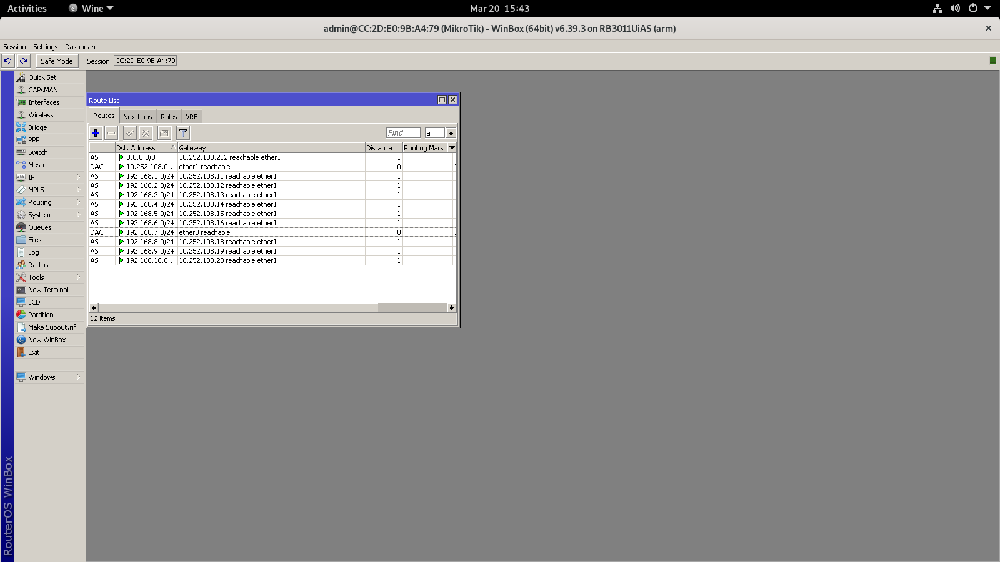 

## Setting DHCP Server Via DHCP Setup (192.168.x.100 - 192.168.x.254)
1. Konfigurasi DHCP Server dapat dilakukan pada menu IP kemudian klik DHCP Server, klik DHCP Setup 
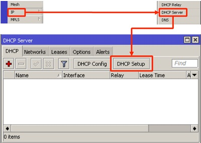 
2. Dengan menekan tombol DHCP Setup, wizard DHCP akan menuntun kita untuk melakukan setting dengan menampilkan kotak-kotak dialog pada setiap langkah nya.  
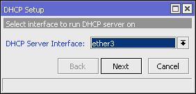 
3. Apabila sudah terpasang IP Addressnya maka DHCP Address Space akan otomatis mendapatkan alamat IP tersebut. IP Address yaitu **192.168.7.0** 
4. Selanjutnya akan muncul dialog kotak Gateway For DHCP Network dengan IP Address sesuai dengan ether 3 yaitu **192.168.7.1** 
5. Selanjutnya isikan address yang telah ditentukan untuk address poolnya.
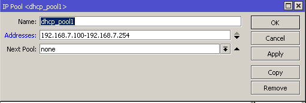 
6. Setelah dilakukan pengisian terhadap address pool, maka address tersebut akan terdaftar pada IP Pool
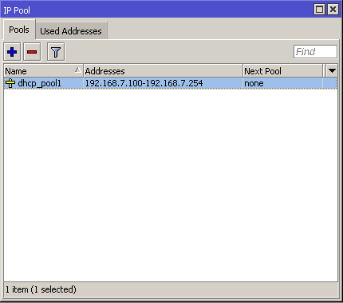 
7. Setelah melakukan langkah - langkah di atas, maka tampilan pada DHCP Server seperti berikut
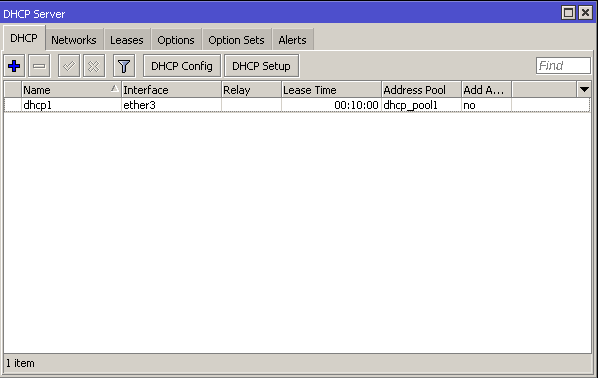 

## Sambungkan PC ke Laptop, Lalu Lakukan Pengecekan Apakah Laptop Sudah Mendapatkan IP dari PC
1. Sambungkan PC ke laptop dengan menggunakan kabel ethernet 
2. Kemudian lakukan pengecekan VM pada laptop, untuk mengetahui IP PC sudah terdapat pada laptop
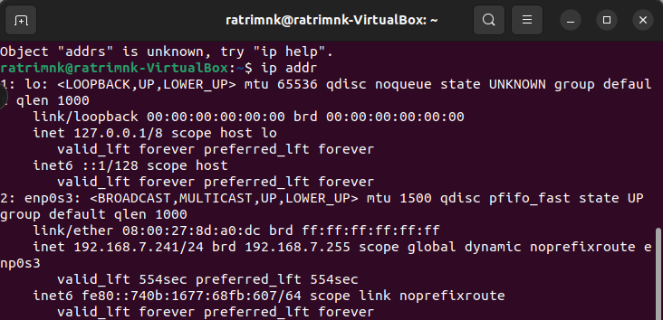 
 

## Nyalakan VM, Pastikan Konfigurasi Jaringan Bridge, Pastikan Mendaptkan IP Address dari DHCP Server
1. Aktifkan VM VirtualBox yang ada pada laptop, kemudian klik Settings, pada bagian Network ubah menjadi Bridge Adapter 
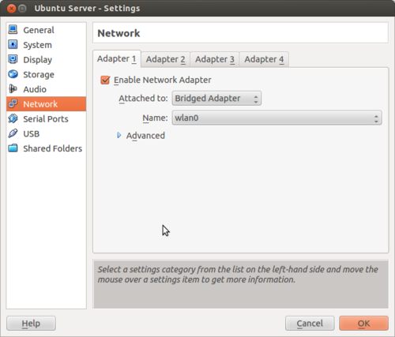 
 

## Konfigurasi IP VM VirtualBox Menjadi Static
1. Lakukan pengeditan pada Wired Connections, klik Wired Settings
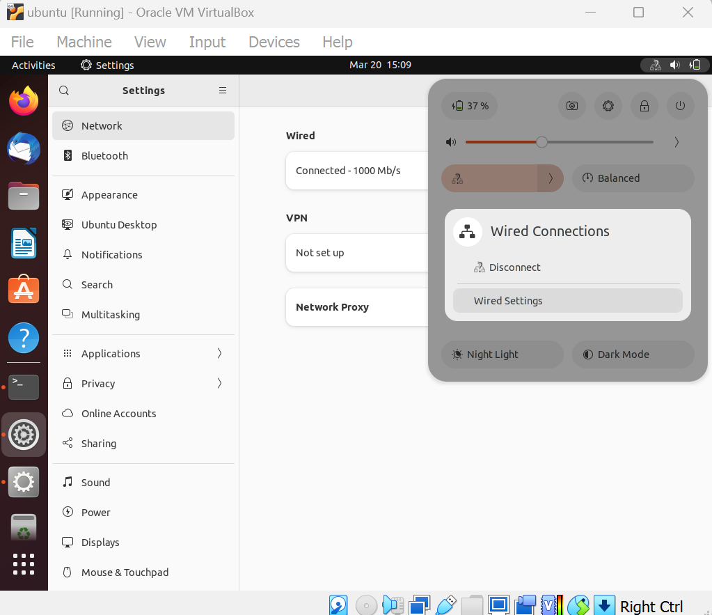 
2. Pilih IPv4, kemudian pada bagian IPv4 Method pilih method "Manual", pada bagian address lakukan pengisian Address, Netmask, dan juga Gateway
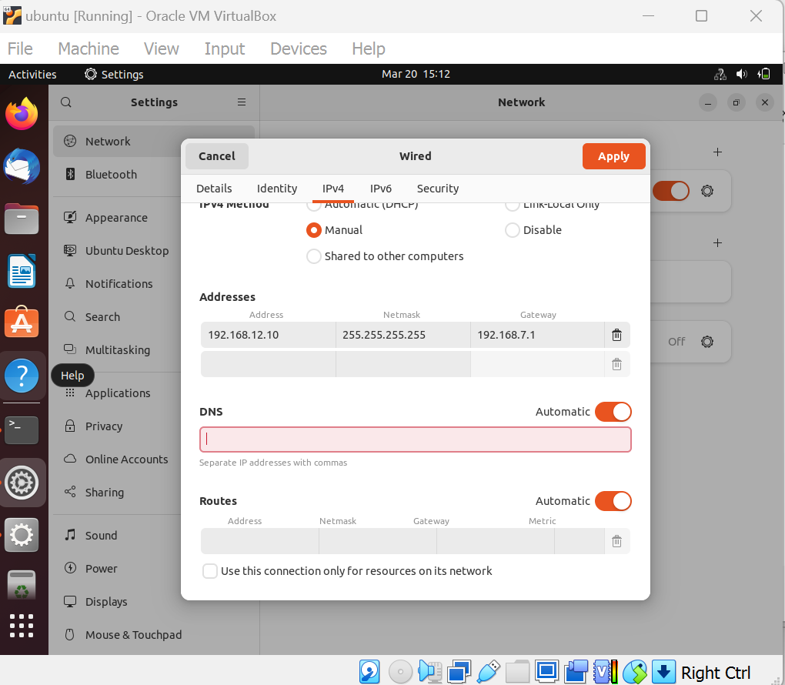 
3. Setelah dilakukan pengisian, klik apply, maka pada bagian Wired Settings (Details), IPv4 Address akan berubah sesuai dengan IP address yang telah kita setting.
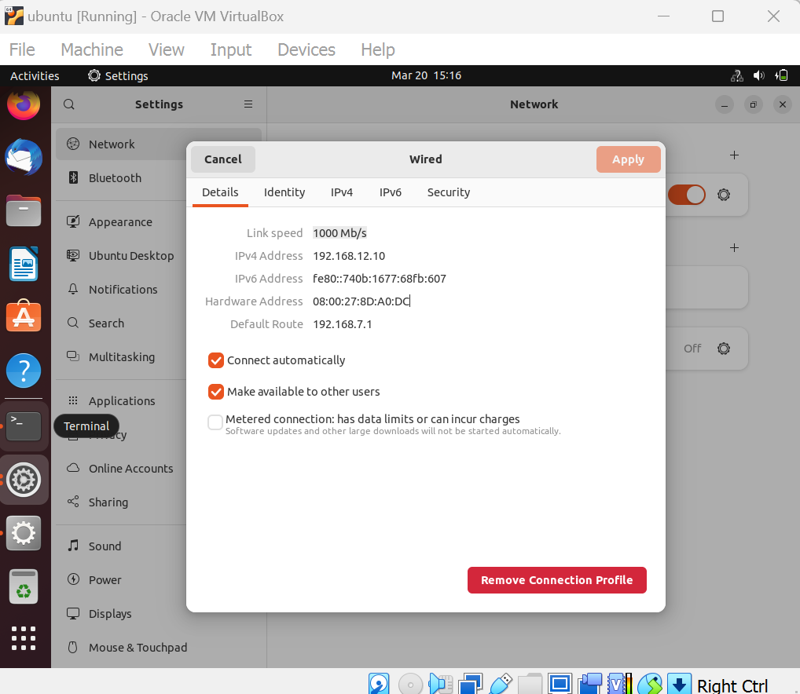 
4. Konfigurasi IP VM menjadi static telah selesai dilakukan 

## Konfigurasi NTP ke 0.id.pool.ntp.org
1. Untuk melakukan konfigurasi NTP, kita dapat mengikuti langkah - langkah yang ada pada website berikut:
**https://github.com/mata-elang-stable/mataelang-platform/wiki/** 
2. Lakukan setup NTP client 
3. Ubah pengaturan jam sistem, atur zona waktu sistem ke zona waktu anda, gunakan perintah "sudo timedatectl set-timezone Asia/Jakarta" 
4. Selanjutnya lakukan pengaturan terhadap RTC ke UTC dengan menggunakan perintah "sudo timedatectl set-local-rtc false" 
5. Selanjutnya akan dilakukan tahap konfigurasi NTP client, dengan mengaktifkan NTP client untuk sinkronisasi waktu, dengan menggunakan perintah "sudo timedatectl set-ntp true" 
6. Edit timesyncd.conf untuk menentukan server NTP yang Anda gunakan, gunakan perintah "sudo nano /etc/systemd/timesyncd.conf"
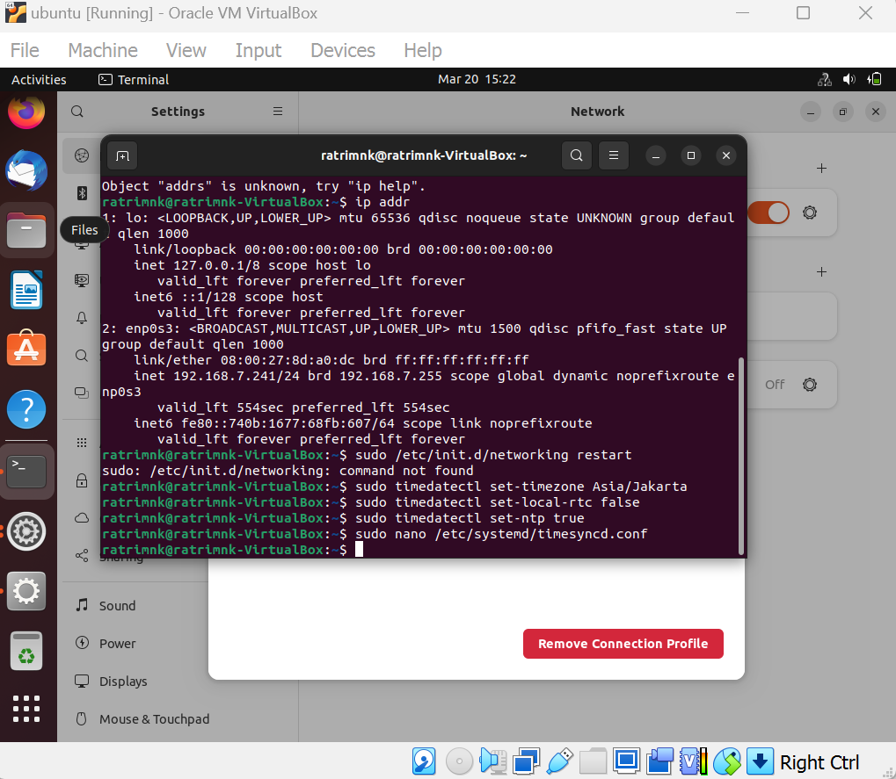 
7. Lakukan konfigurasi NTP seperti perintah berikut: 
**#NTP=**
**NTP=0.id.pool.ntp.org**
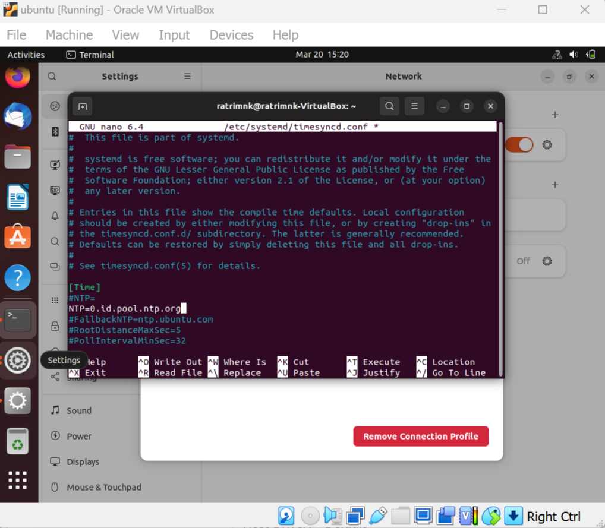 
8. Restart the time synchronization service, dengan menggunakan perintah "sudo systemctl restart systemd-timesyncd" 
9. Kemudian pastikan bahwa layanan sinkronisasi waktu telah aktif, gunakan perintah "systemctl status systemd-timesyncd"
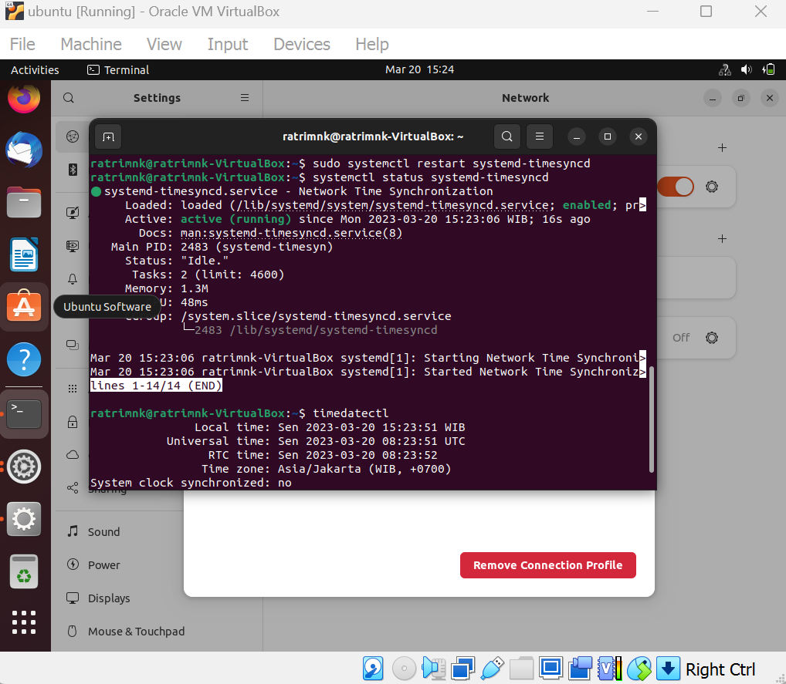 

## Selanjutnya Lakukan Perubahan Terhadap HostName
1. Untuk melakukan perubahan hostname, gunakan perintah berikut "sudo nano /etc/hostname" 
2. Selanjutnya lakukan perubahan hostname, dengan menggunakan format "server10.kelompokx.takehome.com"
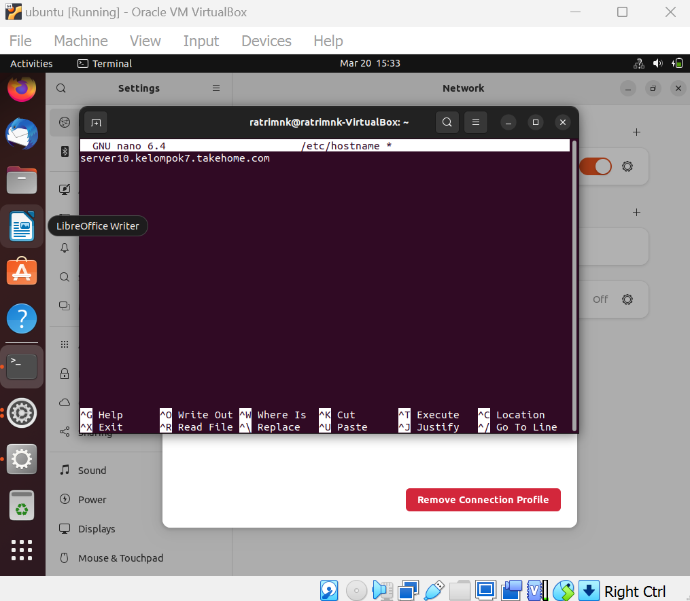 
3. Selanjutnya simpan perubahan dan lihat perubahan hostname.
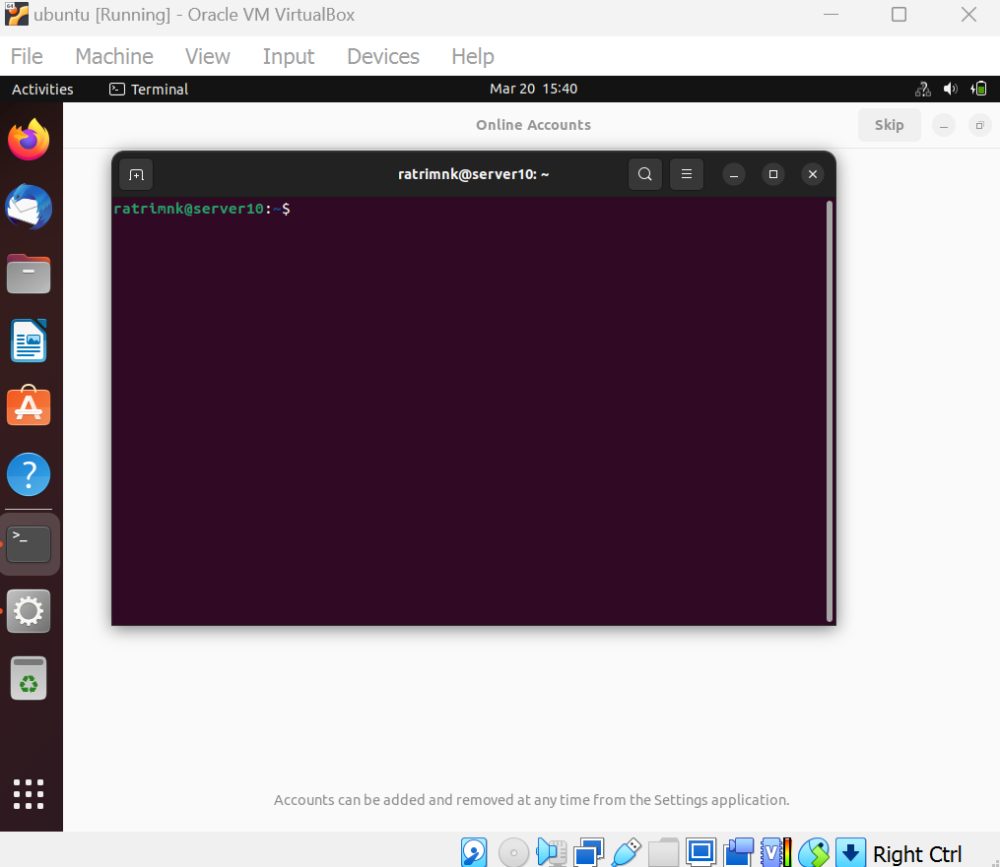 

