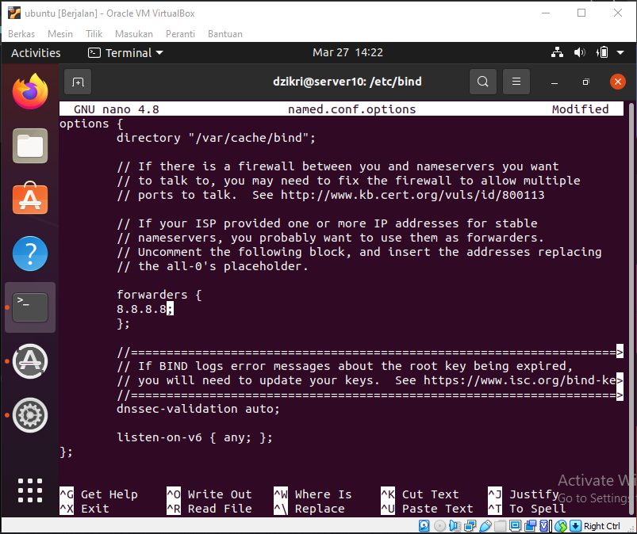
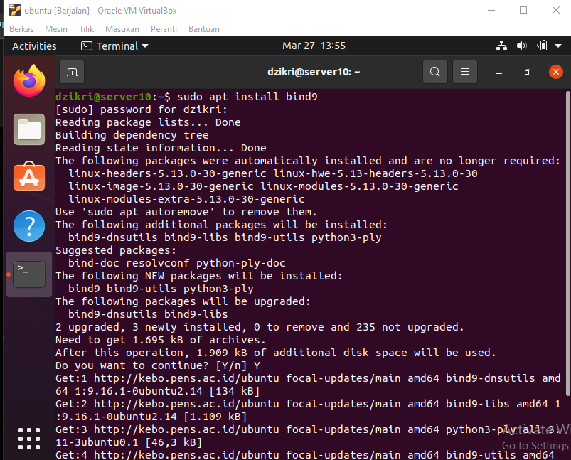
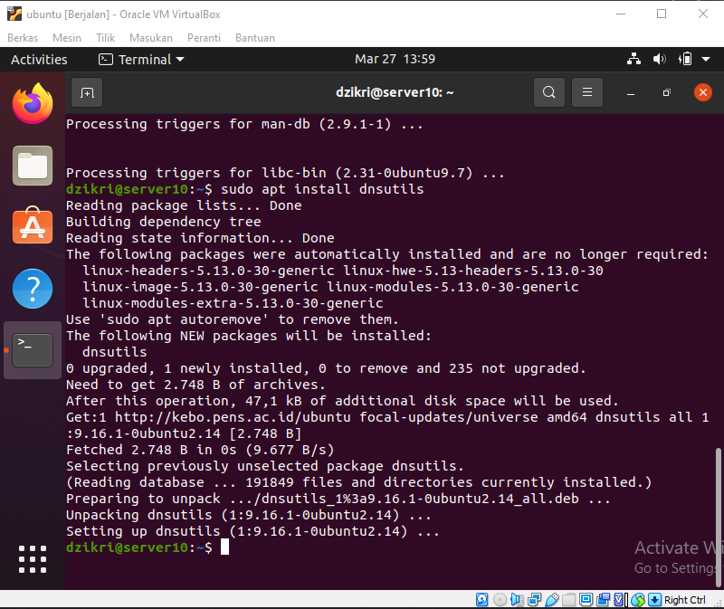
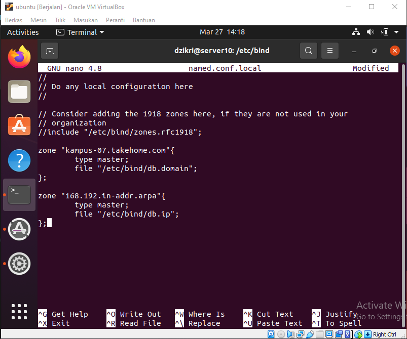
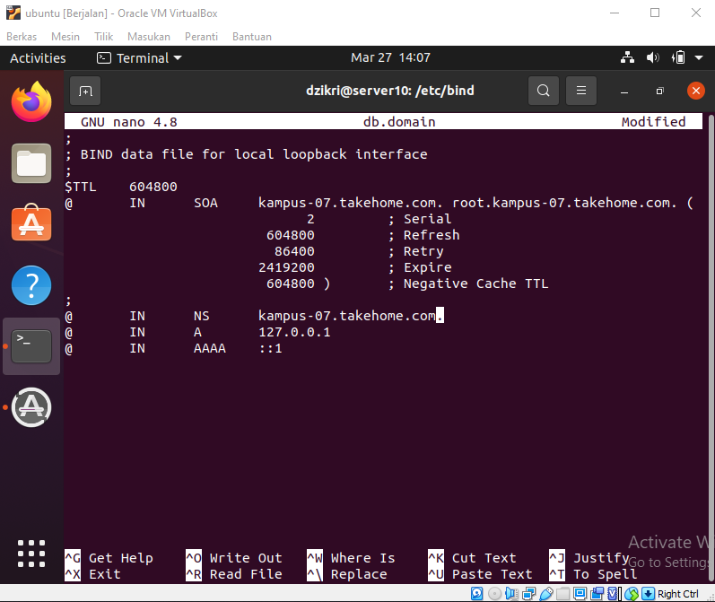
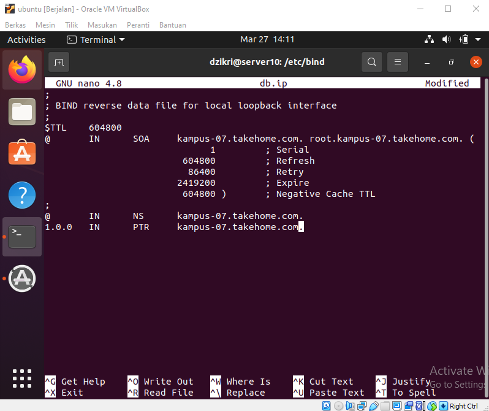
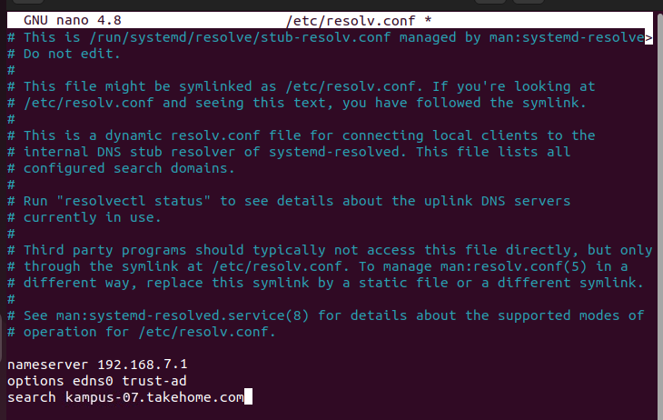
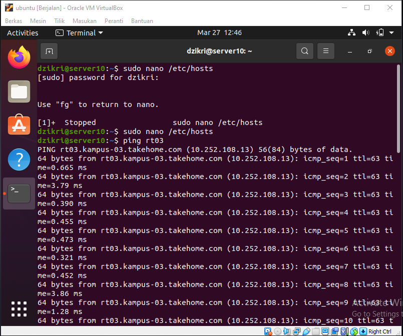

LAPORAN RESMI  
WORKSHOP ADMINISTRASI JARINGAN  
Domain Name Service (DNS)  

  

Dosen Pengampu: 
Dr. Ferry Astika Saputra ST, M.Sc	

Disusun Oleh: 
Latifian Iman (3121600033)  
Ratri Maria Manik (3121600039)  
Dzikri Mutawakkil (3121600041)  

PROGRAM STUDI TEKNIK INFORMATIKA 
POLITEKNIK ELEKTRONIKA NEGERI SURABAYA 
TAHUN 2023

  

## Domain Name Service (DNS)  
Domain Name Service (DNS) adalah layanan Internet yang memetakan alamat IP dan nama domain yang memenuhi syarat (FQDN) satu sama lain. Dengan cara ini, DNS mengurangi kebutuhan untuk mengingat alamat IP. Komputer yang menjalankan DNS disebut name servers. Ubuntu dilengkapi dengan BIND (Berkley Internet Naming Daemon), program yang paling umum digunakan untuk mengelola name servers di Linux.  

## Overview  
File konfigurasi DNS disimpan di direktori /etc/bind. File konfigurasi utama adalah /etc/ bind/named.conf, yang dalam tata letak yang disediakan oleh paket menyertakan berkas-berkas berikut: 

- /etc/bind/named.conf.options: opsi DNS global
- /etc/bind/named.conf.local: untuk zona User
- /etc/bind/named.conf.default-zones: zona default seperti localhost.  

## Caching Name Server 
Konfigurasi default bertindak sebagai caching server. Cukup hapus komentar dan edit bagian forwarders di **/etc/bind/named.conf.** untuk mengatur alamat IP server DNS ISP Anda. 
  
Untuk mengaktifkan konfigurasi baru, mulai ulang server DNS. Dari prompt terminal dengan perintah berikut: 

**sudo systemctl restart bind9.service**  

## Instalasi
Untuk menginstall BIND9, pada terminal jalankan perintah berikut: 
**sudo apt install bind9** 
  
Selanjutnya gunakan perintah 
**sudo apt install dnsutils**
  

## Forward Zone File (Domain ke IP) 
Untuk menambahkan zona DNS ke BIND9 dan mengubah BIND9 menjadi server Primer, gunakan perintah  
**/etc/bind/named.conf.local** 
  
Gunakan zone file yang sudah ada sebagai template untuk membuat berkas /etc/bind/db.example.com dengan menggunakan perintah  
**sudo cp /etc/bind/db.local /etc/bind/db.example.com** 
Forward Zone File (Setelah dilakukan pengeditan)
  

## Reverse Zone File (IP ke Domain)
edit /etc/bind/db.192 dengan mengubah opsi yang sama dengan menjalankan perintah  
**/etc/bind/db.example.com** 
  
Setelah membuat Reverse Zone File, mulai ulang BIND9: 
**sudo systemctl restart bind9.service**  

## Testing
Langkah pertama dalam menguji BIND9 adalah menambahkan Alamat IP nameserver ke host resolver. Nameserver utama harus dikonfigurasi seperti halnya host lain untuk memeriksa ulang berbagai hal. Buka DNS client untuk mengetahui detail tentang cara menambahkan alamat nameserver ke network client. Edit nameserver dan parameter untuk domain pada file /etc/resolv.conf 
  
Terdapat banyak cara untuk melakukan testing, pada kali ini kelompok kami menggunakan metode ping untuk mengetahui apakah konfigurasi sudah berhasil atau belum. Command yang diperlukan: 
**ping www.example.com** 
  

